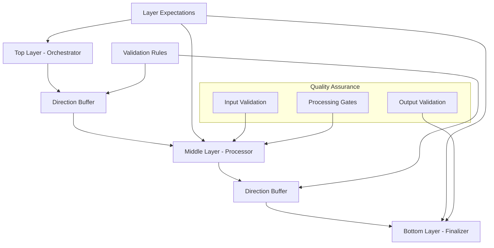

# 3-Layer Framework for Multi-Agent Systems

## Overview

The 3-Layer Framework provides a standardized architecture for implementing multi-agent systems with clear direction and buffers for layer expectations and requirements. This framework ensures proper data flow, validation, and quality assurance between different layers of agent processing.

## Architecture

### Layer Structure



### Layer Responsibilities

#### Top Layer (Orchestrator)
- **Purpose**: Coordinates the entire workflow and defines expectations for downstream layers
- **Responsibilities**:
  - Define workflow steps and requirements
  - Set expectations for middle and bottom layers
  - Orchestrate the overall process
  - Handle high-level error recovery
- **Outputs**: Structured requirements and initial processing directives

#### Middle Layer (Processor)  
- **Purpose**: Executes core business logic with validation buffers
- **Responsibilities**:
  - Process input according to top layer requirements
  - Apply quality gates and validation rules
  - Generate intermediate results for bottom layer
  - Ensure data quality and consistency
- **Outputs**: Processed data with validation metadata

#### Bottom Layer (Finalizer)
- **Purpose**: Produces final output with quality assurance
- **Responsibilities**:
  - Apply finalization rules and formatting
  - Perform final validation and quality checks
  - Generate the final output
  - Ensure output meets all requirements
- **Outputs**: Final validated results

## Key Components

### Layer Expectations

Each layer defines clear expectations for:
- **Input Schema**: Structure and format of expected input data
- **Output Schema**: Structure and format of output data
- **Validation Rules**: Rules that must be satisfied
- **Quality Requirements**: Minimum quality thresholds
- **Performance Constraints**: Timing and resource limits

```python
expectations = LayerExpectation(
    layer_type=LayerType.MIDDLE,
    input_schema={"type": "object", "properties": {...}},
    output_schema={"type": "object", "properties": {...}},
    validation_rules=["rule1", "rule2"],
    quality_requirements={"accuracy": 0.8, "completeness": 0.9},
    performance_constraints={"max_time": 60, "max_memory": "1GB"}
)
```

### Direction Buffers

Buffers manage data flow between layers with validation:
- **Source/Target Layer**: Which layers are communicating
- **Data Validation**: Ensures data meets expectations
- **Metadata Tracking**: Tracks processing history
- **Error Handling**: Captures and reports validation failures

```python
buffer = DirectionBuffer(
    source_layer=LayerType.TOP,
    target_layer=LayerType.MIDDLE,
    expectations=middle_expectations,
    data=processing_data,
    metadata={"timestamp": "2025-01-15T10:00:00Z"},
    validation_results=[]
)

validation = buffer.validate()
```

### Layer Interface

Abstract base class for all layer implementations:

```python
class LayerInterface(ABC, Generic[InputType, OutputType]):
    async def process(self, input_data: InputType) -> OutputType:
        """Process input data and return output"""
        pass
    
    def validate_requirements(self, requirements: Dict[str, Any]) -> bool:
        """Validate that layer can meet the given requirements"""
        pass
    
    def set_input_buffer(self, buffer: DirectionBuffer) -> None:
        """Set the input buffer for this layer"""
        pass
    
    def create_output_buffer(self, target_layer: LayerType, data: OutputType) -> DirectionBuffer:
        """Create output buffer for the next layer"""
        pass
```

## Framework Features

### 1. **Standardized Interfaces**
- Consistent API across all layer types
- Generic type support for different data formats
- Clear separation of concerns

### 2. **Validation and Quality Assurance**
- Input/output validation at every layer boundary
- Quality gates within processing layers
- Comprehensive error handling and reporting

### 3. **Direction and Buffer Management**
- Clear data flow direction (top → middle → bottom)
- Buffered communication with validation
- Metadata tracking for debugging and monitoring

### 4. **Adapter Pattern for Existing Systems**
- Seamless integration with existing agent frameworks
- Support for A2A, ADK, and other systems
- Backward compatibility maintained

### 5. **Orchestration and Workflow Management**
- Centralized workflow coordination
- Execution logging and monitoring
- Performance tracking and optimization

## Fact-Checking Implementation

The framework includes a complete fact-checking implementation:

### Components

1. **FactCheckAuditor** (Top Layer)
   - Orchestrates fact-checking workflow
   - Defines requirements for claim analysis and revision
   - Manages overall quality and performance expectations

2. **FactCheckCritic** (Middle Layer)
   - Extracts claims from input text
   - Verifies claims using external sources
   - Applies quality gates for evidence gathering

3. **FactCheckReviser** (Bottom Layer)
   - Applies revisions based on verification results
   - Maintains original style and structure
   - Ensures final output quality

### Usage Example

```python
from shared.layer_framework import ThreeLayerOrchestrator
from shared.layer_framework.fact_checking import (
    FactCheckAuditor, FactCheckCritic, FactCheckReviser, FactCheckRequest
)

# Create layers
auditor = FactCheckAuditor()
critic = FactCheckCritic()
reviser = FactCheckReviser()

# Create orchestrator
orchestrator = ThreeLayerOrchestrator(
    top_layer=auditor,
    middle_layer=critic,
    bottom_layer=reviser
)

# Execute fact-checking
request = FactCheckRequest(
    question="Is the Earth flat?",
    answer="The Earth is flat and NASA is lying to us.",
    context="Scientific discussion"
)

result = await orchestrator.execute_workflow(request)
print(f"Revised answer: {result.revised_answer}")
print(f"Quality score: {result.quality_score}")
```

## Agent System Adapters

The framework provides adapters for existing agent systems:

### A2A Adapter

```python
from shared.layer_framework.adapters import A2AAdapter, A2AAgentConfig

config = A2AAgentConfig(
    auditor_url="http://localhost:8080",
    critic_url="http://localhost:8001",
    reviser_url="http://localhost:8002",
    model_name="o3",
    model_provider="openai"
)

adapter = A2AAdapter(config)
result = await adapter.execute_fact_check(request)
```

### ADK Adapter

```python
from shared.layer_framework.adapters import ADKAdapter, ADKAgentConfig

config = ADKAgentConfig(
    agent_module_path="agents.agent",
    model_endpoint="http://localhost:8080",
    mcp_gateway_endpoint="http://localhost:8811/sse"
)

adapter = ADKAdapter(config)
result = await adapter.execute_fact_check(request)
```

### Universal Adapter

```python
from shared.layer_framework.adapters import UniversalAgentAdapter

# Works with both A2A and ADK
adapter = UniversalAgentAdapter("a2a", a2a_config)
# or
adapter = UniversalAgentAdapter("adk", adk_config)

result = await adapter.execute_fact_check(request)
```

## Testing and Validation

### Running Tests

```bash
# Run the test framework
cd shared/layer_framework
python test_framework.py
```

### Running Examples

```bash
# Run example demonstrations
cd shared/layer_framework
python examples.py
```

### Test Coverage

The test suite covers:
- ✅ Layer expectation creation and validation
- ✅ Buffer validation and data flow
- ✅ Direction buffer creation and management
- ✅ Fact-checking layer implementations
- ✅ 3-layer orchestrator functionality
- ✅ A2A and ADK adapter integration
- ✅ End-to-end workflow execution

## Integration Guide

### For Existing Agent Systems

1. **Identify Your Layer Structure**
   - Map existing agents to top/middle/bottom layers
   - Define clear responsibilities for each layer

2. **Create Layer Expectations**
   - Define input/output schemas
   - Specify validation rules and quality requirements
   - Set performance constraints

3. **Implement or Adapt Layers**
   - Extend framework base classes
   - Or create adapters for existing agents

4. **Configure Buffers and Validation**
   - Set up direction buffers between layers
   - Configure validation rules
   - Add quality gates as needed

5. **Test and Monitor**
   - Use the test framework to validate integration
   - Monitor execution logs and buffer validations
   - Optimize based on performance metrics

### For New Agent Systems

1. **Start with Framework Base Classes**
   - Extend TopLayer, MiddleLayer, BottomLayer
   - Implement required abstract methods

2. **Define Clear Interfaces**
   - Specify data types for input/output
   - Create comprehensive expectations
   - Add validation logic

3. **Use the Orchestrator**
   - Let ThreeLayerOrchestrator manage workflow
   - Focus on layer-specific logic
   - Leverage built-in monitoring and logging

## Best Practices

### 1. **Clear Separation of Concerns**
- Each layer should have a single, well-defined responsibility
- Avoid mixing orchestration logic with processing logic
- Keep interfaces clean and minimal

### 2. **Comprehensive Validation**
- Validate all inputs and outputs at layer boundaries
- Use schemas to define expected data structures
- Implement meaningful error messages

### 3. **Quality Gates**
- Add quality checks within processing layers
- Define minimum thresholds for acceptance
- Implement fallback strategies for quality failures

### 4. **Performance Monitoring**
- Track execution times and resource usage
- Monitor buffer validation success rates
- Log detailed execution information

### 5. **Error Handling**
- Implement graceful degradation for failures
- Provide clear error messages and context
- Use buffer validations to catch issues early

## Framework Benefits

### 1. **Standardization**
- Consistent architecture across different agent systems
- Reusable components and patterns
- Clear documentation and examples

### 2. **Quality Assurance**
- Built-in validation at every layer boundary
- Quality gates and performance monitoring
- Comprehensive error handling

### 3. **Flexibility**
- Support for different agent frameworks
- Adapter pattern for existing systems
- Generic type support for various data formats

### 4. **Maintainability**
- Clear separation of concerns
- Well-defined interfaces and expectations
- Comprehensive testing framework

### 5. **Scalability**
- Modular architecture supports growth
- Performance monitoring enables optimization
- Buffer management handles varying workloads

## Future Enhancements

### Planned Features
- Support for parallel processing within layers
- Advanced monitoring and analytics dashboard
- Configuration management for different deployment environments
- Integration with more agent frameworks (CrewAI, LangGraph, etc.)
- Performance optimization and caching strategies

### Extension Points
- Custom validation rule engines
- Pluggable quality gate implementations
- Advanced error recovery strategies
- Integration with external monitoring systems
- Support for multi-tenant deployments